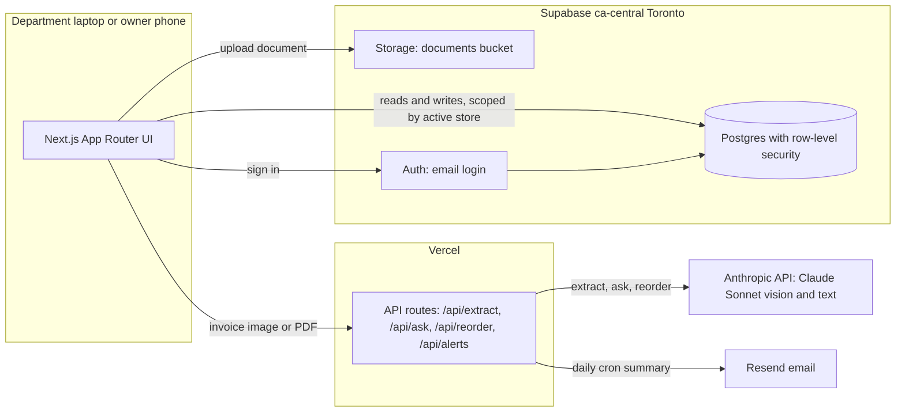
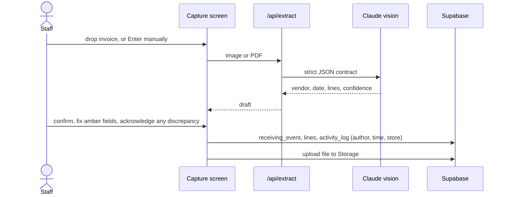

# Architecture and how we work

## What we are building
Robinsons General Store operations platform. A capture-first receiving app: staff drop a vendor invoice on the department laptop, a vision model reads it, they confirm one screen, it posts to the department feed with author and time, and the owner sees everything remotely. Later phases add pricing and inventory, orders and payments, reorder forecasting, a manager dashboard, and an assistant over the store's own data.

The store is Robinsons General Store, the general store Ravikiran acquired, in Dorset, Ontario. Heavy summer seasonality. Lakeside Dry Goods and L_S and Dry goods are a section inside it, not the store name.

## System diagram
GitHub renders these Mermaid blocks.

## Architecture
- Frontend and API: Next.js App Router on Vercel, TypeScript.
- Database, auth, storage, vectors: Supabase Postgres in a Canadian region, ca-central Toronto.
- Document AI: Claude Sonnet vision only today, through ANTHROPIC_API_KEY and ANTHROPIC_MODEL via /api/extract. GPT-4o fallback and AWS Textract are deferred, not built.
- Ask-your-store: /api/ask passes the store's notes, vendors, and invoices to Claude as context, which works at this scale. pgvector is the deferred upgrade when the data outgrows one prompt.
- Notifications: email (Resend) now, SMS (Twilio) later.
- Not the enterprise stack. No Snowflake, Fabric, Redpanda, MuleSoft, API gateway, or MCP governance at this scale. The upgrade path is earned only if it grows to many stores. See robinsons_store_build_spec.md section 8.
- Budget ceiling a couple hundred a month, realistic run 50 to 100.

## Data flow (the capture loop)
1. Staff selects a department and uploads or drops an invoice image or PDF on the capture screen.
2. The browser sends the file to /api/extract.
3. The route calls the vision model with a strict JSON contract and returns vendor, date, line items, and notes, each with a confidence score.
4. The confirm screen shows the draft, flags low-confidence fields, and lets staff fix one field.
5. On save, the file goes to Supabase Storage, a receiving_event plus its lines are written, and an activity_log row records who and when.
6. The home feed reads recent receiving_events per department.

## Data model
The shipped schema is supabase/schema.sql. The entity list and conventions are in the skill at .claude/skills/robinsons-store/references/data-model.md. Key rules: snake_case, audit on every write, a confidence value per extracted line, low-confidence dollar fields never auto-post, money as integer cents before production. The open dev row-level security is the demo default; the per-store, per-role policies in supabase/auth_setup.sql take over when NEXT_PUBLIC_REQUIRE_AUTH is enabled (see RUNBOOK.md).

## Design system
The design philosophy is capture first. The color and form rules are in the skill at .claude/skills/robinsons-store/references/design-tokens.md, with the tokens wired into src/app/globals.css. Calm neutral canvas, one meaning per status hue, labels above fields, scan do not type, WCAG AA.

## Canada
Ontario 13 percent HST default, a tax_rules table for portability, PIPEDA for staff data, Quebec Law 25 only if Quebec data, Canadian regions preferred.

## Build status
Phases 1 through 6 plus property and maintenance, compliance, and HR are shipped. The live source of truth for what is done and what remains is docs/STATUS.md. robinsons_store_build_spec.md is the original plan, kept for history. Deferred by design: pgvector for ask-your-store at scale, ML reorder forecasting, SMS alerts, and column-level database privileges for cost fields. The enterprise-stack upgrade path is in the build spec section 8.

## How we work in Claude Code
- Open this repo folder in Claude Code. The skill at .claude/skills/robinsons-store loads automatically and keeps work consistent with the architecture, the schema, the design, and the output rules.
- First session: ask Claude Code to read robinsons_store_build_spec.md and the skill, then set up and run the project.
- To add a feature, describe it plainly, for example add live webcam capture, or build the Phase 2 pricing history screen. The skill enforces the locked stack and conventions.
- Commit and push as you go. Keep this doc and the build spec current as phases complete.
- Human-in-the-loop on every dollar field stays non-negotiable.
